# CI/CD PIPELINE FOR PHP BASED APPLICATION
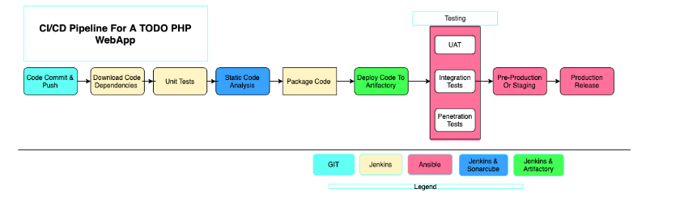

## Project Description

In this project, I will be setting up a CI/CD pipeline for PHP based application. The CI/CD process looks like the architecture above.

This project consist of two major repositories with each repository containing its own CI/CD pipeline written in a Jenkinsfile.
- **Ansible-Config** : This repository contains Jenkinsfile which is responsible for setting up and configuration infrastructure required to carry out processess required for our application to run. Using ansible roles and playbooks.

- **PHP-todo** : This repository contains Jenkinsfile which is focused on processes which are application build specific such as building, static code analysis, push to arfitact, sonarqube etc.

# Prerequisites

In this project we'll be using AWS ec2 instances/ VM. 

**Nginx Server** : This server will act as our reverse proxy to our site and tool.

**Jenkins Server** : This jenkins server wil host our CI tools. Implement our CI/CD pipeline. Using T2.medium, Security group shoud be 8080

**Sonarqube Server** : To be used for code quality analysis. Using T2.medium, Security group shoud be 9000
 
**Artifactory Server** : To be used for storing our build in a binary format. Using T2.micro, Security group shoud be 8082

**Todo Webserver** : To host our todo web app

**Database Server** : Database server for our todo application

## Environments


Ansible Inventory should look like this
```
├── ci
├── dev
├── pentest
├── pre-prod
├── prod
├── sit
└── uat
```

To automate the setup of `Sonarqube` and `Jfrog Artifactory`, we can use `ansible-galaxy` to install configuration into our ansible roles which will be used and run against the `sonarqube` and `artifactory server`

Configure Ansible For Jenkins Deployment

Create a Jenkins Server with a T2.medium specification because we need more compute power to run builds.

## Prepare The Jenkins Server 

Connect to the Jenkins server using ssh via ssh and gitbash using windows. 

On gitbash using ssh-agent to connect to all the other servers.

```
eval $(ssh-agent -s)
ssh-add private-pem-key-file
```
On Gitbash use `code .` When you run  `code .` it tells Visual Studio Code to open the current directory as a project.


## Install the following packages and dependencies on the Jenkins Server

- Install git : `sudo yum install git -y`

- Clone repository: `git clone` https://github.com/lucm9/Ansible-Config.git

- Java will be needed before installing Jenkins modify with Bash_profile and reload and input Java Path

- Install jenkins and its dependencies from this link : https://www.jenkins.io/doc/book/installing/linux/

- Download and configure ansible

- Log onto jenkins Server using the `public-ip:8080`

Once we have logged on the Jenkins Server, click on manage jenkins -> Manager plugins -> Available plugins, search for `Blue Bcean`

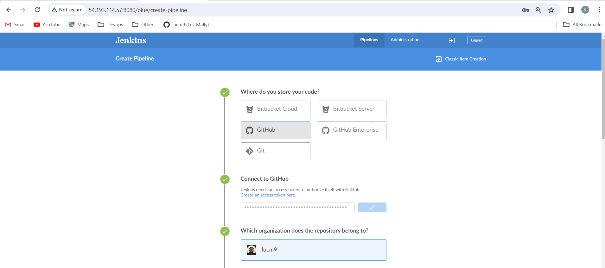

- Click on personal tocken authentication in order to generate your own. 

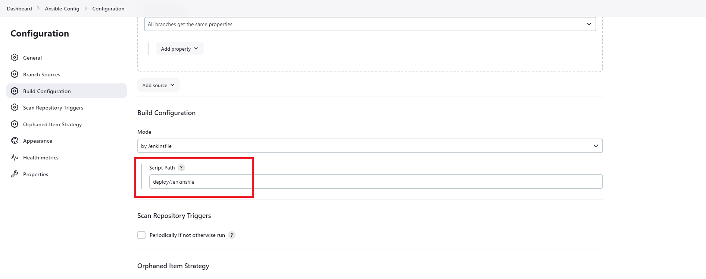

- Input Jenkins file path to help jenkins locate the file.

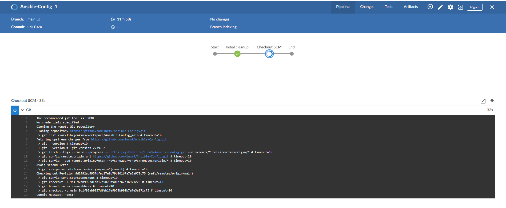

## Running Ansible Playbook From Jenkins

Install Ansible plugin from jenkins same way we installed Blue Ocean 

Install ansible on the Jenkins Server as well. Follow this link for more on installing Ansible based on your OS. -> https://docs.ansible.com/ansible/latest/installation_guide/installation_distros.html

Under Jenkins Management -> add `usr/bin` for ansible

Add the following script to the Jenkinsfile 

with this file we are deploying to the dev environment

```
pipeline {
  agent any

  environment {
      ANSIBLE_CONFIG="${WORKSPACE}/deploy/ansible.cfg"
    }

  parameters {
      string(name: 'inventory', defaultValue: 'dev',  description: 'This is the inventory file for the environment to deploy configuration')
    }

  stages{
      stage("Initial cleanup") {
          steps {
            dir("${WORKSPACE}") {
              deleteDir()
            }
          }
        }

      stage('Checkout SCM') {
         steps{
            git branch: 'main', url: 'https://github.com/lucm9/Ansible-Config.git'
         }
       }

      stage('Prepare Ansible For Execution') {
        steps {
          sh 'echo ${WORKSPACE}' 
          sh 'sed -i "3 a roles_path=${WORKSPACE}/roles" ${WORKSPACE}/deploy/ansible.cfg'  
        }
     }

      stage('Run Ansible playbook') {
        steps {
           ansiblePlaybook become: true, colorized: true, credentialsId: 'private-key', disableHostKeyChecking: true, installation: 'ansible', inventory: 'inventory/${inventory}', playbook: 'playbooks/site.yml', vaultTmpPath: ''
         }
      }

      stage('Clean Workspace after build'){
        steps{
          cleanWs(cleanWhenAborted: true, cleanWhenFailure: true, cleanWhenNotBuilt: true, cleanWhenUnstable: true, deleteDirs: true)
        }
      }
   }

}
```


- Ensure Jenkins is using the `main` branch `master` branch is not longer active due to BLM

- Jenkins needs to export the ANSIBLE_CONFIG environment variable. create a new file as ansible.cfg in the deploy folder add the below script

```
[defaults]
timeout = 160
callback_whitelist = profile_tasks
log_path=~/ansible.log
host_key_checking = False
gathering = smart
ansible_python_interpreter=/usr/bin/python3
allow_world_readable_tmpfiles=true


[ssh_connection]
ssh_args = -o ControlMaster=auto -o ControlPersist=30m -o ControlPath=/tmp/ansible-ssh-%h-%p-%r -o ServerAliveInterval=60 -o ServerAliveCountMax=60 -o ForwardAgent=yes
```

In our Jenkinsfile above there's a parameterization. It will look like this 

```

parameters {
    string(name: 'inventory', defaultValue: 'dev',  
    description: 'This is the inventory file for the
    environment to deploy configuration')
    }
```

In the Jenkinsfile remove the hardcoded inventory/dev and replace with ${inventory}

```
stage('Run Ansible playbook') {
    steps {
           ansiblePlaybook become: true, colorized: true, credentialsId: 'private-key', disableHostKeyChecking: true, installation: 'ansible', inventory: 'inventory/${inventory}', playbook: 'playbooks/site.yml', vaultTmpPath: ''
         }
      }
```

## CI/CD PIPELINE FOR TODO APP 

The goal here is to deploy our todo app onto servers directly from the `Artifactory` rather than from git.

- Update Ansible-Config repo with Artifatory role. Install artifactory role from Ansible-galaxy repository.

- Once its installed open the browser and type the URL http://public-ip:8082

On the jenkins-server git clone the php-app repository. 

## Install PHP and other packages

```
sudo yum module reset php -y
sudo dnf module install php:remi-8.3 -y
sudo yum module enable php:remi-8.3 -y
sudo yum install php php-cli php-fpm php-json php-common php-mysql php-zip php-gd php-mbstring php-curl php-xml php-pear php-bcmath -y
sudo systemctl start php-fpm
sudo systemctl enable php-fpm
```
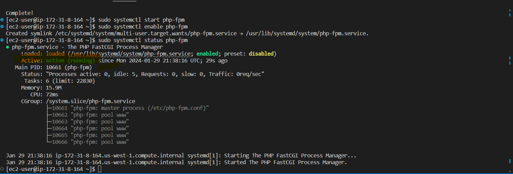

On the Jenkins-Server Install Plot plugin and Artifactory Plugin.

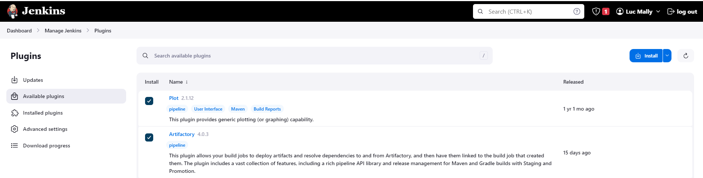


Run the jenkinsfile to triggr ansible playbook to install and setup the artifactory server.

update the CI inventory with the artifact private-ip

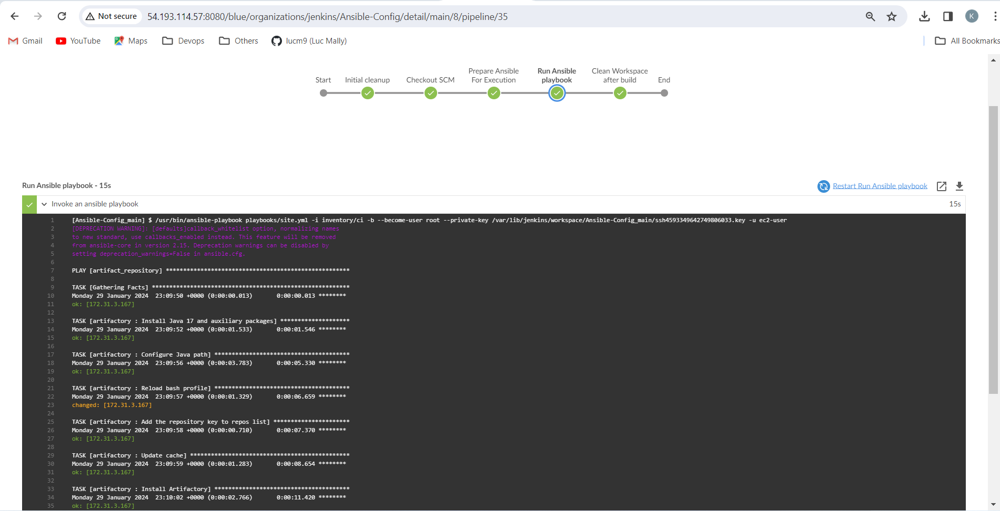

Setup Security Group

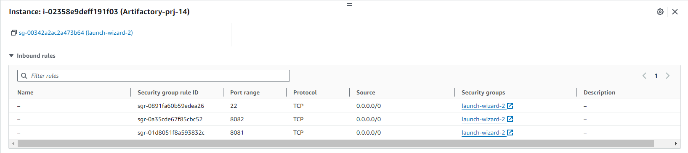

Create a `Generic` repository called PBL. This repository will be used to store the binary build artifact. 

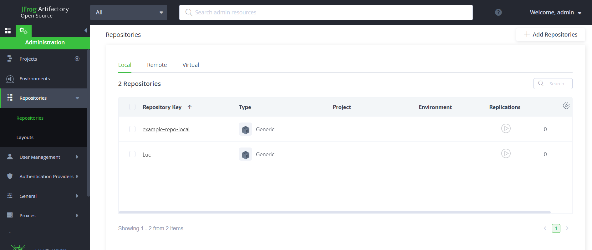

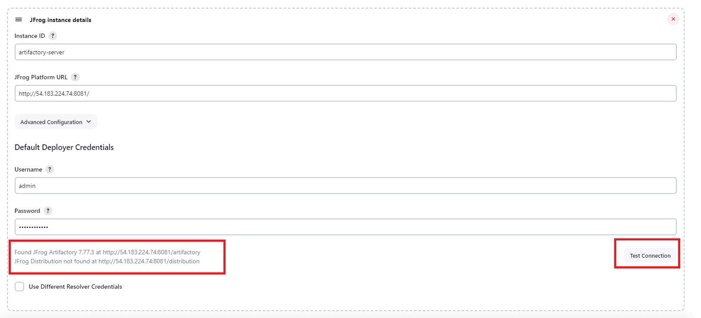

## Integrate Artifact Repository With Jenkins

 - Create a new Jenkinsfile in the Php-Todo Repository
 - Using Blue Ocean, Create a new pipeline
 - Install mysql Client: `sudo yum install mysql -y`
 - Update mysql bind address to 0.0.0.0
 - Create database `Homestead` and user 
 - Run php-todo pipeline

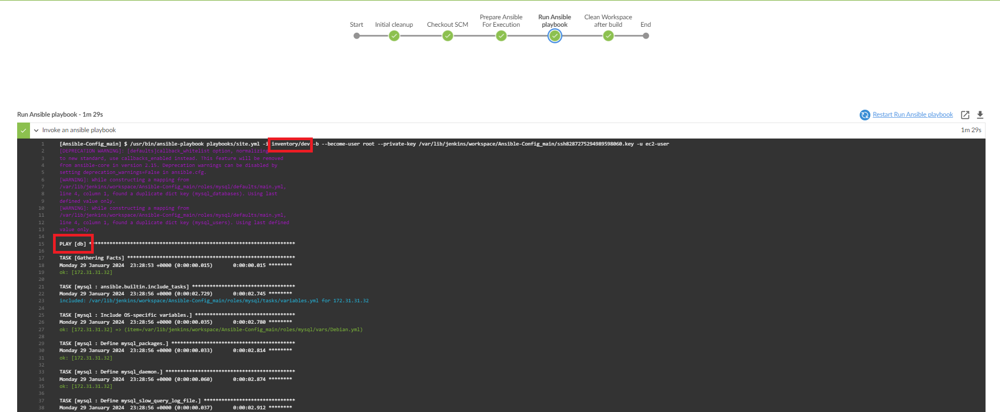

Verify the database 


Visualizing the PHP code analytics using the Jenkins Plot plugin.


 


Bundle the code into an artifact and upload to the artifactory.

- install zip `sudo yum install zip -y`
```
stage ('Package Artifact') {
      steps {
            sh 'zip -qr php-todo-app.zip ${WORKSPACE}/*'
     }
    }

```

Publish the artifact into the artifactory 
```
 stage ('Upload Artifact to Artifactory') {
        steps {
            script { 
                 def server = Artifactory.server 'artifactory-server'                 
                 def uploadSpec = """{
                    "files": [
                      {
                       "pattern": "php-todo-app.zip",
                       "target": "Luc/php-todo-app",
                       "props": "type=zip;status=ready"

                       }
                    ]
                 }""" 

                 server.upload spec: uploadSpec
               }
            }

        }
```


Now we deploy the application to our dev environment using by launching our ansible pipeline. Ensure to update the inventory/dev with the private ip of the Webserver and update the site.yml to only run for the dev server. 

```
        stage ('Deploy to Dev Environment') {
          steps {
            build job: 'Ansible-Config/main', parameters: [[$class: 'StringParameterValue', name: 'env', value: 'dev']], propagate: false, wait: true
    }
  }

```

## Install Sonarqube

SonarQube is a tool that can be used to create quality gates for software projects, and the ultimate goal is to be able to ship only quality software code.

Even though we have implemented Unit Tests and Code Coverage Analysis with phpunit and phploc, we still need to implement Quality Gate to ensure that only code with the required code coverage, and other quality standards make it through to the environments.

On our ansible-config repository create a sonarqube role and install sonarqube.


Log onto the server using Public-ip:9000/sonar 
 - username : admin
 - password: admin 

## Jenkins-Server With SonarQube

Install Sonarqube plugin on Jenkins 

 
  

Generate authentication token in SonarQube


Configure Quality Gate Jenkins Webhook in SonarQube — The URL should point to your Jenkins server
 


We use the token to set up the webhook.

Setup SonarQube scanner from Jenkins — Global Tool Configuration

 

Update Jenkins pipeline to include sonarqube scanning and Quality Gate. 

```
  stage('SonarQube Quality Gate') {
      when { branch pattern: "^develop*|^hotfix*|^release*|^main*", comparator: "REGEXP"}
        environment {
            scannerHome = tool 'SonarQubeScanner'
        }
        steps {
            withSonarQubeEnv('sonarqube') {
                sh "${scannerHome}/bin/sonar-scanner -Dproject.settings=sonar-project.properties"
            }
            timeout(time: 1, unit: 'MINUTES') {
                waitForQualityGate abortPipeline: true
            }
        }
    }
    
```

The above step will fail because we have no uploaded the sonar.properties. 

- Go into cd /var/lib/jenkins/tools/hudson.plugins.sonar.SonarRunnerInstallation/SonarQubeScanner/conf/.
- Open Sonar-scanner.properties file: `sudo vi sonar-scanner.properties`
- Add configuration related to the php-todo project or which ever name you give it. 

## sonar properties
```
sonar.host.url=http://3.125.17.131:9000/sonar/ sonar.projectKey=php-todo #----- Default source code encoding sonar.sourceEncoding=UTF-8 sonar.php.exclusions=/vendor/ sonar.php.coverage.reportPaths=build/logs/clover.xml sonar.php.tests.reportPath=build/logs/junit.xml
```


## JENKINS-SLAVE

We can setup Jenkins-slave and configure Jenkins to run its pipeline jobs randomly on any available slave nodes.

First, we create the Jenkins-slave instances


 


